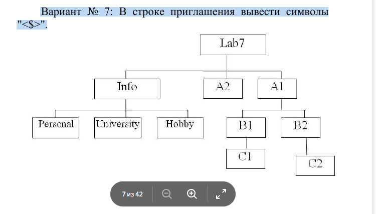

# Лабораторная работа № 1
# Командная строка Windows
## Цель работы: Развитие профессиональных навыков
## работы в командной строке Windows.
Задачи работы:
– Создание структуры каталогов;
– Создание, просмотр, редактирование, удаление файлов;
– Удаление структуры каталогов;
– Манипулирование операционной системой Windows с
помощью командной строки.
Задание на лабораторную работу
Загрузить командную строку (Пуск – Программы –
Стандартные – Командная строка).
1) В каталоге Temp создать дерево каталогов по
вариантам как показано в вариантах заданий с использованием
команд табл. 1.
2) В каталоге А2 создать подкаталоги В4 и В5 и удалить
каталог В2.
3) В каталоге Personal создать файл Name.txt,
содержащий информацию о фамилии, имени и отчестве
студента. Здесь же создать файл Date.txt, содержащий
информацию о дате рождения студента. В этом же каталоге
создать файл School.txt, содержащий информацию о школе,
которую закончил студент.
4) В каталоге University создать файл Name.txt,
содержащий информацию о названии вуза и специальность, на
которой студент обучается. Здесь же создать файл Mark.txt с
оценками на вступительных экзаменах и общей суммой баллов.
5) В каталоге Hobby создать файл hobby.txt с
информацией об увлечениях студента.
6) Скопировать файл hobby.txt в каталог А2 и
переименовать его в файл Lab_№варианта.txt.

## Выполнение задачи:

Microsoft Windows [Version 10.0.17763.8511]
(c) Корпорация Майкрософт (Microsoft Corporation), 2018. Все права защищены.

C:\Users\29503808>temp
"temp" не является внутренней или внешней
командой, исполняемой программой или пакетным файлом.

C:\Users\29503808>md labvar7

C:\Users\29503808>labvar7 md A2
"labvar7" не является внутренней или внешней
командой, исполняемой программой или пакетным файлом.

C:\Users\29503808>cd labvar7

C:\Users\29503808\labvar7>md A2

C:\Users\29503808\labvar7>md A1

C:\Users\29503808\labvar7>md Info

C:\Users\29503808\labvar7>cd A1

C:\Users\29503808\labvar7\A1>md B1

C:\Users\29503808\labvar7\A1>md B2

C:\Users\29503808\labvar7\A1>cd B1

C:\Users\29503808\labvar7\A1\B1>md C1

C:\Users\29503808\labvar7\A1\B1>cd B2
Системе не удается найти указанный путь.

C:\Users\29503808\labvar7\A1\B1>cd B2
Системе не удается найти указанный путь.

C:\Users\29503808\labvar7\A1\B1>cd
C:\Users\29503808\labvar7\A1\B1

C:\Users\29503808\labvar7\A1\B1>cd
C:\Users\29503808\labvar7\A1\B1

C:\Users\29503808\labvar7\A1\B1>cd A1
Системе не удается найти указанный путь.

C:\Users\29503808\labvar7\A1\B1>cd
C:\Users\29503808\labvar7\A1\B1

C:\Users\29503808\labvar7\A1\B1>cd
C:\Users\29503808\labvar7\A1\B1

C:\Users\29503808\labvar7\A1\B1>cd
C:\Users\29503808\labvar7\A1\B1

C:\Users\29503808\labvar7\A1\B1>cd
C:\Users\29503808\labvar7\A1\B1

C:\Users\29503808\labvar7\A1\B1>cd A1
Системе не удается найти указанный путь.

C:\Users\29503808\labvar7\A1\B1>cd B2
Системе не удается найти указанный путь.

C:\Users\29503808\labvar7\A1\B1>bc
"bc" не является внутренней или внешней
командой, исполняемой программой или пакетным файлом.

C:\Users\29503808\labvar7\A1\B1>cd -
Системе не удается найти указанный путь.

C:\Users\29503808\labvar7\A1\B1>cd ..

C:\Users\29503808\labvar7\A1>cd B2

C:\Users\29503808\labvar7\A1\B2>md C2

C:\Users\29503808\labvar7\A1\B2>cd ..

C:\Users\29503808\labvar7\A1>cd ..

C:\Users\29503808\labvar7>cd info

C:\Users\29503808\labvar7\Info>md Personal

C:\Users\29503808\labvar7\Info>md University

C:\Users\29503808\labvar7\Info>md Hobby

C:\Users\29503808\labvar7\Info>cd ..

C:\Users\29503808\labvar7>personal
"personal" не является внутренней или внешней
командой, исполняемой программой или пакетным файлом.

C:\Users\29503808\labvar7>cd personal
Системе не удается найти указанный путь.

C:\Users\29503808\labvar7>cd Personal
Системе не удается найти указанный путь.

C:\Users\29503808\labvar7>cd info

C:\Users\29503808\labvar7\Info>cd personal

C:\Users\29503808\labvar7\Info\Personal>copy con Name.txt
Брагэ М.В

copy con Name.txt

cd ..
^Z
Скопировано файлов:         1.

C:\Users\29503808\labvar7\Info\Personal>md Date.txt

C:\Users\29503808\labvar7\Info\Personal>edit Date.txt
"edit" не является внутренней или внешней
командой, исполняемой программой или пакетным файлом.

C:\Users\29503808\labvar7\Info\Personal>copy con Date.txt
27.09.2007
27.09.2007
^Z
Скопировано файлов:         1.

C:\Users\29503808\labvar7\Info\Personal>md School.txt

C:\Users\29503808\labvar7\Info\Personal>copy con School.txt
School №19 Sergiev Posad
School №19 Sergiev Posad
^Z
Скопировано файлов:         1.

C:\Users\29503808\labvar7\Info\Personal>cd ..

C:\Users\29503808\labvar7\Info>md University
Подпапка или файл University уже существует.

C:\Users\29503808\labvar7\Info>cd University

C:\Users\29503808\labvar7\Info\University>copy con Name.txt
^Z
Скопировано файлов:         1.

C:\Users\29503808\labvar7\Info\University>copy con Name.txt
MOF MFUA
Заменить Name.txt [Yes (да)/No (нет)/All (все)]: yes
Prikladnaya informatika
^Z
Скопировано файлов:         1.

C:\Users\29503808\labvar7\Info\University>copy con Mark.txt
Russian language - 58
Math - 52
Informatika - 46
^Z
Скопировано файлов:         1.

C:\Users\29503808\labvar7\Info\University>cd ..

C:\Users\29503808\labvar7\Info>cd Hobby

C:\Users\29503808\labvar7\Info\Hobby>copy con Hobby.txt
Computer
dota2^Z
Скопировано файлов:         1.

C:\Users\29503808\labvar7\Info\Hobby>cd ..

C:\Users\29503808\labvar7\Info>cd personal

C:\Users\29503808\labvar7\Info\Personal>rd Date.txt

C:\Users\29503808\labvar7\Info\Personal>rd School.txt

C:\Users\29503808\labvar7\Info\Personal>copy con Date.txt
27.09.2007
^Z
Скопировано файлов:         1.

C:\Users\29503808\labvar7\Info\Personal>copy con School.txt
School №19 Sergiev Posad
^Z
Скопировано файлов:         1.

C:\Users\29503808\labvar7\Info\Personal>copy con all.txt
27.09.2007
Brage M.V
School N.19 Sergiev Posad
^Z
Скопировано файлов:         1.

C:\Users\29503808\labvar7\Info\Personal>copy C:\Users\29503808\labvar7\Info\Personal\all.txt C:\Users\29503808\labvar7\A1
Скопировано файлов:         1.

C:\Users\29503808\labvar7\Info\Personal>cd ..

C:\Users\29503808\labvar7\Info>cd ..

C:\Users\29503808\labvar7>rd A2

C:\Users\29503808\labvar7>rd C2
Не удается найти указанный файл.

C:\Users\29503808\labvar7>cd A1

C:\Users\29503808\labvar7\A1>cd B2

C:\Users\29503808\labvar7\A1\B2>rd C2

C:\Users\29503808\labvar7\A1\B2>cd ..

C:\Users\29503808\labvar7\A1>rd B2

C:\Users\29503808\labvar7\A1>