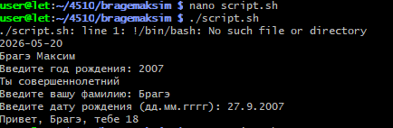

# Задание
## 1. Подключитесь к Rasberry PI по протоколу SSH
## 2. Зайдите в каталог Вашей группы/фамилии
## 3. Создайте файл скрипта с расширением .sh
## 4. Напишите и запустите скрипт со следующим функционалом:
# Требуется:
## Вывести текущую время и дату
## Вывести сообщение с Вашей фамилией
## Ввести год рождения и вывести сообщение, являетесь ли Вы совершеннолетним

[Скрипт](script.sh)
