# Лабораторная работа на тему: система журналирования в операционных системах Linux
## Настроим системное время:
timedatectl list-timezones

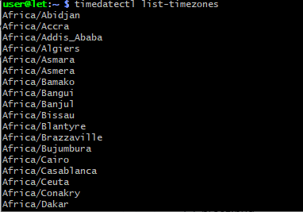

sudo timedatectl set-timezone zone

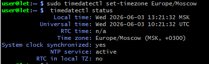

journalctl

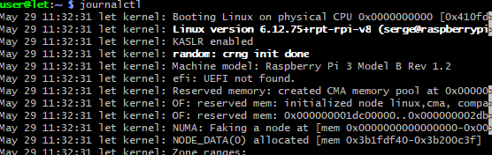

## Предыдущие загрузки

sudo mkdir -p /var/log/journal

sudo nano /etc/systemd/journald.conf

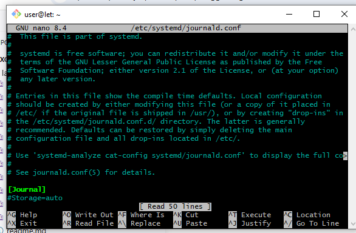

## Временные окна

journalctl --since "2022-01-10 17:15:00"

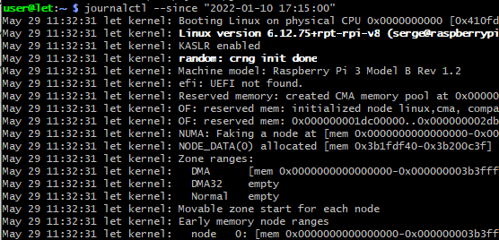

journalctl --since yesterday

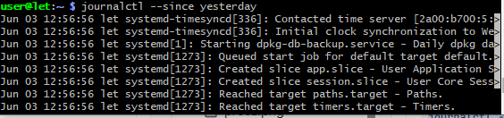

# Фильтр по значимости
## По единицам

journalctl -u nginx.service

journalctl -u nginx.service --since today

id -u www-user

journalctl _UID=33 --since today

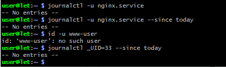
## По пути компонента

journalctl /usr/bin/bash

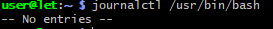

## Отображение сообщений ядра

journalctl -k

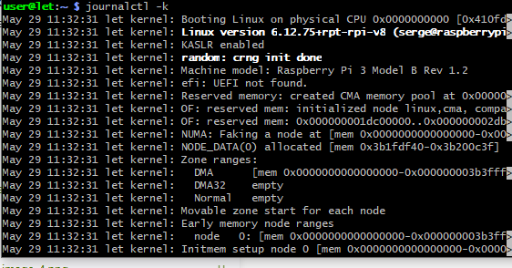

journalctl -k -b -5

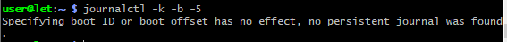

## По приоритету

journalctl -p err –b

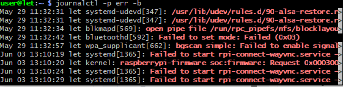

# Выводы
Мы разобрали, как использовать утилиту journalctl в основных режимах. Она весьма полезна для системных администраторов за счет гибкой фильтрации данных при чтении журналов. Расширение функций осуществляется за счет применения различных опций, основные из которых рассмотрели в текущей работе